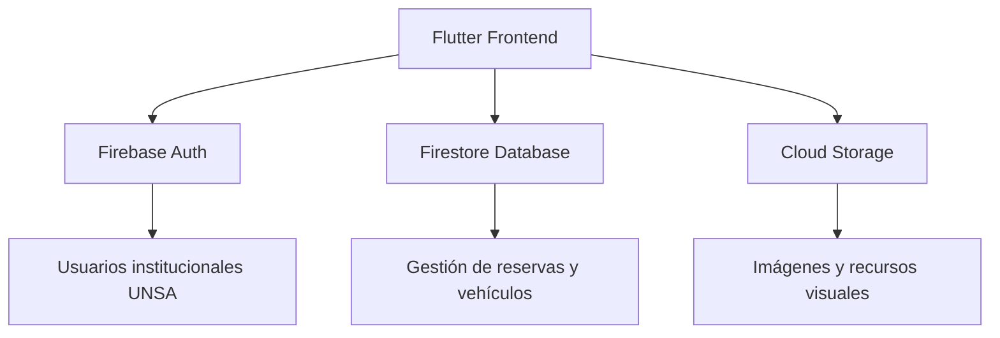

# 🚗 Estaciona UNSA

Estaciona UNSA es una aplicación móvil multiplataforma desarrollada con Flutter para optimizar la gestión de estacionamientos en la Universidad Nacional de San Agustín de Arequipa (UNSA). Permite a estudiantes, docentes y personal administrativo visualizar, registrar y reservar espacios en tiempo real, con autenticación institucional y registro de historial de uso.

---

## Índice
- [Descripción](#descripción)
- [Características principales](#características-principales)
- [Tecnologías](#tecnologías)
- [Arquitectura](#arquitectura)
- [Instalación y ejecución](#instalación-y-ejecución)
- [Configuración de Firebase](#configuración-de-firebase)
- [Uso](#uso)
- [Contribución](#contribución)
- [Equipo](#equipo)
- [Licencia](#licencia)
- [Créditos y recursos visuales](#créditos-y-recursos-visuales)

---

## Descripción

El objetivo de Estaciona UNSA es mejorar la movilidad interna y el control del flujo vehicular dentro de los campus universitarios, proporcionando una interfaz intuitiva y funciones de gestión en tiempo real. La solución está pensada como prototipo académico con posibilidades de extensión (IoT, integración con cámaras, reservas programadas, etc.).

---

## Características principales

- Gestión en tiempo real de ocupación de espacios (disponible / ocupado).
- Registro y asociación de vehículos a usuarios institucionales.
- Autenticación segura con correos institucionales UNSA.
- Visualización de zonas de parqueo mediante mapa o cuadrícula.
- Sistema de reservas y notificaciones (Firebase Cloud Messaging).
- Historial de entradas/salidas y tiempos de uso.
- UI moderna basada en Material Design 3, responsive y multiplataforma.

---

## Tecnologías

| Categoría | Tecnología |
|-----------:|-----------|
| Framework  | Flutter |
| Lenguaje   | Dart |
| BBDD       | Firebase Firestore |
| Auth       | Firebase Authentication |
| Mensajería | Firebase Cloud Messaging |
| Almacenamiento | Firebase Cloud Storage |
| UI/UX      | Material Design 3 |
| Control de versiones | Git / GitHub |

---

## Arquitectura



---

## Instalación y ejecución

### Requisitos previos
- Flutter SDK (>=3.0.0)
- Android Studio o VS Code con extensiones Flutter/Dart
- Cuenta de Firebase y proyecto creado
- Git

### Pasos Rápidos

1. **Clonar el repositorio:**
   ```bash
   git clone https://github.com/Choflis/EstacionaUNSA.git
   cd EstacionaUNSA/estaciona_unsa
   ```

2. **Instalar dependencias:**
   ```bash
   flutter pub get
   ```

3. **Configurar Firebase:**
   ```bash
   flutterfire configure
   ```
   - Selecciona el proyecto Firebase "EstacionaUNSA"
   - Verifica que se generó `lib/firebase_options.dart`

4. **Ejecutar la app:**
   ```bash
   flutter run
   ```

> 📚 **Documentación detallada:** Ver [`documentacion/SETUP.md`](documentacion/SETUP.md) para instrucciones completas de configuración.

**Nota (Windows):** Habilita el modo desarrollador para soporte de symlinks:
```bash
start ms-settings:developers
```

---

## 📚 Documentación

Toda la documentación técnica del proyecto está organizada en la carpeta [`documentacion/`](documentacion/):

### 📖 Documentos Finales

| Documento | Descripción |
|-----------|-------------|
| [`MANUAL_USUARIO.md`](documentacion/MANUAL_USUARIO.md) | Manual completo de usuario con guía de todas las funcionalidades |
| [`INFORME_FINAL.md`](documentacion/INFORME_FINAL.md) | Informe técnico del proyecto con proceso de desarrollo, tecnologías y lecciones aprendidas |

### 🔧 Documentación Técnica

| Documento | Descripción |
|-----------|-------------|
| [`SETUP.md`](documentacion/SETUP.md) | Guía completa de configuración (Firebase, Google Sign-In, Firestore) |
| [`DATABASE.md`](documentacion/DATABASE.md) | Estructura de la base de datos, modelos y relaciones |
| [`DESARROLLO.md`](documentacion/DESARROLLO.md) | Guía de desarrollo, arquitectura y convenciones de código |
| [`GUIA_INTEGRACION_PROVIDERS.md`](documentacion/GUIA_INTEGRACION_PROVIDERS.md) | Guía para integrar providers en la aplicación |

### 🧪 Testing

| Documento | Descripción |
|-----------|-------------|
| [`testing/`](documentacion/testing/) | Plan completo de testing en 5 fases con evidencias y resultados |

---

## Configuración de Firebase (resumen)

- Authentication:
  - Habilita el proveedor de correo electrónico (`Email/Password`) o el flujo que uses para las cuentas institucionales.
  - Implementa control por dominio (ej. permitir solo correos con dominio `@unsa.edu.pe`). Esto puede hacerse a nivel de la aplicación (validación al registrar/iniciar sesión) y reforzarse en el backend (Cloud Functions / reglas de seguridad).

- Firestore:
  - Diseña reglas de seguridad que restrinjan lecturas/escrituras según la autenticación del usuario y su rol.
  - Ejemplo conceptual (no aplicar sin pruebas):
    ```
    service cloud.firestore {
      match /databases/{database}/documents {
        match /usuarios/{userId} {
          allow read, write: if request.auth != null && request.auth.uid == userId;
        }
        match /reservas/{reservaId} {
          allow create: if request.auth != null;
          allow read: if request.auth != null;
          allow update, delete: if request.auth != null && resource.data.propietario == request.auth.uid;
        }
      }
    }
    ```

- Cloud Storage:
  - Restringe el acceso a archivos por usuario y uso previsto.
  - Firma URLs o usa reglas para controlar subida/lectura.

- Notificaciones:
  - Configura Firebase Cloud Messaging y añade la implementación en la app para recibir notificaciones push.

---

## Uso (breve)

- Registro / Inicio de sesión: usa una cuenta institucional UNSA.
- Registrar vehículo: desde el perfil puedes añadir matrícula, modelo y foto (opcional).
- Reservar espacio: selecciona zona y franja horaria en la interfaz de mapas o cuadrículas.
- Historial: revisa entradas/salidas y tiempos en la sección de historial.

---

## Contribución

Si quieres contribuir:
1. Haz fork del repositorio.
2. Crea una rama con la funcionalidad: `git checkout -b feat/nombre-funcion`
3. Realiza tus cambios y pruebas locales.
4. Abre un Pull Request describiendo el cambio y los pasos para testearlo.

Por favor, abre issues describiendo bugs o propuestas de mejora antes de PR grandes. Añade pruebas y documentación cuando sea posible.

---

## Equipo

- Luis Guillermo Luque Condori — Líder de proyecto / Desarrollador Flutter  
- Dennis Javier Quispe Saavedra — Diseño UI/UX  
- Fernando Miguel Garambel Marín — Backend & Firebase

---

## Descarga

**APK Android:**  
El archivo APK compilado (`estaciona-unsa.apk`) está disponible en la carpeta `estaciona_unsa/` del repositorio.

**Video Demostrativo:**  
Disponible en Google Drive junto con el APK.

---

## Licencia

Proyecto con fines académicos y educativos, desarrollado en la Universidad Nacional de San Agustín de Arequipa. El código puede usarse para aprendizaje y mejora tecnológica; para otros usos, solicita permiso a los autores.

---

## Créditos y recursos visuales

- Recursos de imágenes: Unsplash, Pexels y otros bancos libres (respecta las licencias y atribuciones cuando apliquen).
- Iconografía y diseño: Material Design 3.

<p align="center">
  
</p>
