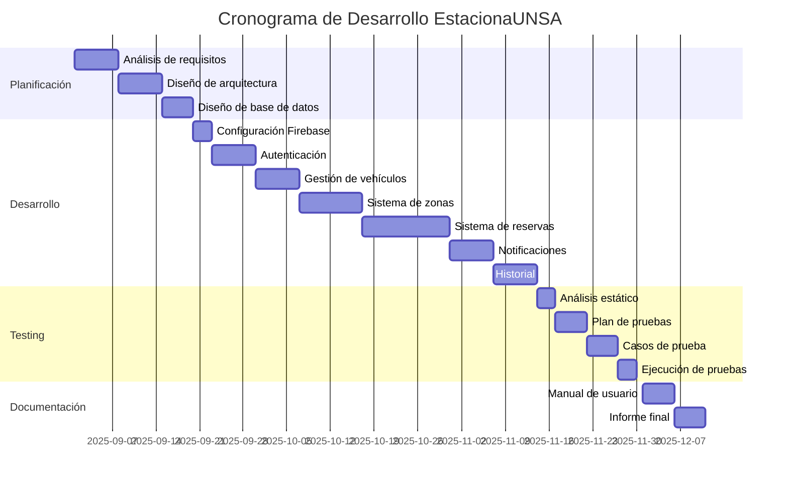
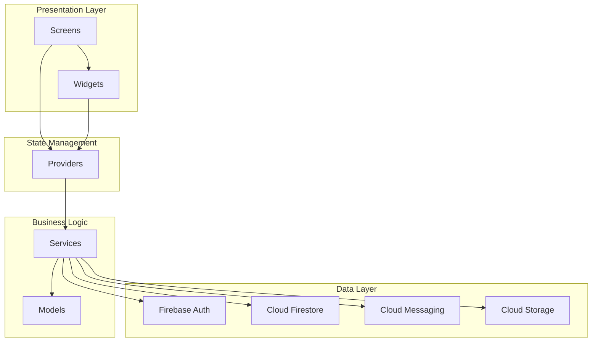
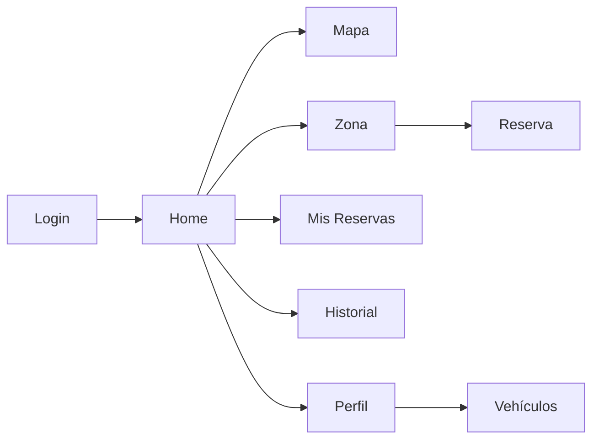
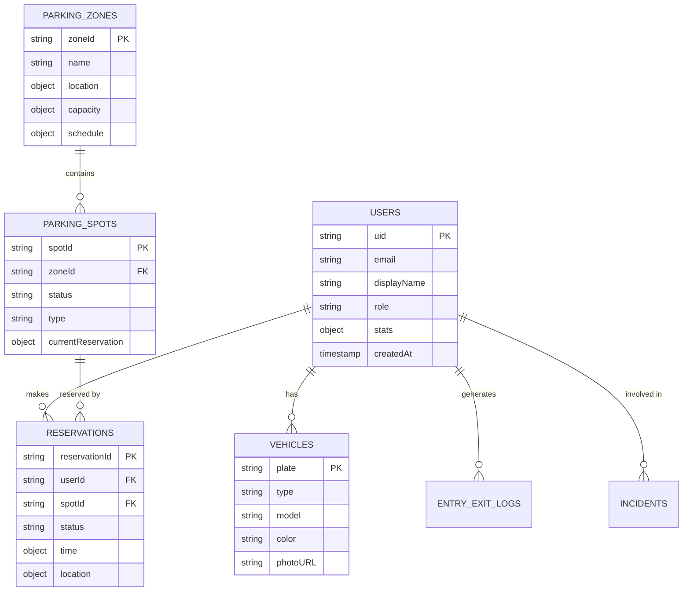

# 📊 Informe Final - EstacionaUNSA

**Sistema de Gestión de Estacionamientos Universitarios**

---

**Universidad Nacional de San Agustín de Arequipa**  
**Escuela Profesional de Ingeniería de Sistemas**  
**Curso:** Construcción de Software  

**Equipo de Desarrollo:**
- Luis Guillermo Luque Condori - Líder de Proyecto / Desarrollador Flutter
- Dennis Javier Quispe Saavedra - Diseño UI/UX  
- Fernando Miguel Garambel Marín - Backend & Firebase

**Versión:** 1.0  
**Fecha:** Diciembre 2025

---

## 📑 Índice

1. [Resumen Ejecutivo](#1-resumen-ejecutivo)
2. [Enlaces del Proyecto](#2-enlaces-del-proyecto)
3. [Introducción](#3-introducción)
4. [Proceso de Desarrollo](#4-proceso-de-desarrollo)
5. [Tecnologías Empleadas](#5-tecnologías-empleadas)
6. [Arquitectura del Sistema](#6-arquitectura-del-sistema)
7. [Funcionalidades Implementadas](#7-funcionalidades-implementadas)
8. [Interfaces de Usuario](#8-interfaces-de-usuario)
9. [Base de Datos](#9-base-de-datos)
10. [Testing y Calidad](#10-testing-y-calidad)
11. [Mantenimiento](#11-mantenimiento)
12. [Lecciones Aprendidas](#12-lecciones-aprendidas)
13. [Conclusiones](#13-conclusiones)
14. [Referencias](#14-referencias)

---

## 1. Resumen Ejecutivo

EstacionaUNSA es una solución móvil multiplataforma desarrollada con Flutter para optimizar la gestión de estacionamientos en la Universidad Nacional de San Agustín de Arequipa. El proyecto aborda la problemática de la falta de información en tiempo real sobre la disponibilidad de espacios de estacionamiento, lo que genera pérdida de tiempo y congestión vehicular en el campus universitario.

### Objetivos Alcanzados

✅ **Visualización en tiempo real** de la disponibilidad de espacios en 3 zonas principales  
✅ **Sistema de reservas** con restricciones de distancia y tiempo  
✅ **Autenticación institucional** exclusiva para la comunidad UNSA  
✅ **Gestión de vehículos** con registro de múltiples unidades  
✅ **Historial completo** de entradas y salidas  
✅ **Sistema de notificaciones** push para alertas importantes  
✅ **Control de penalizaciones** automático para uso responsable  

### Resultados Clave

- **120 espacios** de estacionamiento gestionados en 3 zonas
- **Arquitectura escalable** basada en Clean Architecture y Provider Pattern
- **Base de datos en tiempo real** con Firebase Firestore
- **Plan de testing completo** con 5 fases documentadas
- **30 errores críticos** corregidos durante el análisis estático

---

## 2. Enlaces del Proyecto

### Repositorio de Código

**GitHub:**  
https://github.com/Choflis/EstacionaUNSA.git

El repositorio contiene:
- Código fuente completo de la aplicación Flutter
- Documentación técnica y de desarrollo
- Plan de testing y evidencias
- Configuración de Firebase
- Reglas de seguridad de Firestore

### Aplicación Compilada y Video

**Google Drive:**  
[Enlace pendiente - Se proporcionará el enlace al Drive con el APK y video demostrativo]

El Drive incluirá:
- `estaciona-unsa.apk` - Aplicación compilada para Android
- `demo-estacionaunsa.mp4` - Video demostrativo de las funcionalidades

---

## 3. Introducción

### 3.1 Contexto y Problemática

La Universidad Nacional de San Agustín de Arequipa cuenta con múltiples zonas de estacionamiento distribuidas en su campus. Sin embargo, los usuarios (estudiantes, docentes y personal administrativo) enfrentan los siguientes problemas:

1. **Falta de información en tiempo real** sobre espacios disponibles
2. **Pérdida de tiempo** buscando estacionamiento
3. **Congestión vehicular** en horas pico
4. **Ausencia de control** sobre el uso de espacios
5. **Dificultad para planificar** la llegada al campus

### 3.2 Objetivos del Proyecto

#### Objetivo General

Desarrollar una aplicación móvil multiplataforma que permita a la comunidad UNSA visualizar, reservar y gestionar espacios de estacionamiento en tiempo real, mejorando la movilidad interna y el control del flujo vehicular.

#### Objetivos Específicos

1. Implementar un sistema de autenticación seguro con correos institucionales
2. Desarrollar un módulo de visualización en tiempo real de espacios disponibles
3. Crear un sistema de reservas con restricciones de distancia y tiempo
4. Diseñar una interfaz intuitiva y moderna basada en Material Design 3
5. Implementar un sistema de notificaciones push
6. Desarrollar un módulo de historial y estadísticas de uso
7. Establecer un sistema de penalizaciones para uso responsable

### 3.3 Alcance

**Incluye:**
- Aplicación móvil para Android (iOS en desarrollo futuro)
- Gestión de 3 zonas principales de estacionamiento (120 espacios totales)
- Sistema de reservas con duración de 15 minutos
- Autenticación con Firebase Authentication
- Base de datos en tiempo real con Firestore
- Notificaciones push con Firebase Cloud Messaging
- Historial completo de uso

**No incluye:**
- Integración con cámaras de seguridad
- Sensores IoT para detección automática de vehículos
- Sistema de pagos
- Aplicación web administrativa (en roadmap futuro)
- Integración con sistemas académicos de la UNSA

---

## 4. Proceso de Desarrollo

### 4.1 Metodología Utilizada

El proyecto se desarrolló utilizando una **metodología ágil adaptada** con sprints de 1-2 semanas, permitiendo iteraciones rápidas y ajustes basados en retroalimentación.

#### Principios Aplicados

- **Desarrollo iterativo e incremental**
- **Comunicación constante** entre miembros del equipo
- **Documentación continua** de decisiones técnicas
- **Testing desde etapas tempranas**
- **Revisión de código** mediante pull requests

### 4.2 Fases del Proyecto



### 4.3 Distribución de Tareas

| Miembro | Responsabilidades Principales |
|---------|------------------------------|
| **Luis Guillermo Luque Condori** | • Líder de proyecto y coordinación<br>• Desarrollo de UI/UX con Flutter<br>• Implementación de providers<br>• Sistema de navegación<br>• Plan de pruebas y QA |
| **Dennis Javier Quispe Saavedra** | • Diseño de interfaces y experiencia de usuario<br>• Implementación de widgets personalizados<br>• Testing de componentes UI<br>• Diseño de flujos de usuario<br>• Pruebas funcionales |
| **Fernando Miguel Garambel Marín** | • Configuración y gestión de Firebase<br>• Desarrollo de servicios backend<br>• Implementación de Firestore<br>• Reglas de seguridad<br>• Testing de integración y backend |

---

## 5. Tecnologías Empleadas

### 5.1 Stack Tecnológico Completo

#### Frontend - Aplicación Móvil

| Tecnología | Versión | Propósito |
|------------|---------|-----------|
| **Flutter** | 3.24.5 | Framework principal para desarrollo multiplataforma |
| **Dart** | 3.5.4 | Lenguaje de programación |
| **Material Design 3** | Latest | Sistema de diseño para UI/UX |
| **Provider** | 6.1.2 | Gestión de estado |
| **Google Maps Flutter** | 2.9.0 | Visualización de mapas |
| **Geolocator** | 13.0.2 | Servicios de geolocalización |

#### Backend - Firebase

| Servicio | Propósito |
|----------|-----------|
| **Firebase Authentication** | Autenticación de usuarios con email/password |
| **Cloud Firestore** | Base de datos NoSQL en tiempo real |
| **Firebase Cloud Messaging** | Notificaciones push |
| **Cloud Storage** | Almacenamiento de imágenes de vehículos |
| **Firebase Analytics** | Análisis de uso (opcional) |

#### Herramientas de Desarrollo

| Herramienta | Propósito |
|-------------|-----------|
| **Visual Studio Code** | IDE principal |
| **Android Studio** | Emuladores y debugging Android |
| **Git / GitHub** | Control de versiones |
| **Flutter DevTools** | Debugging y profiling |
| **Postman** | Testing de APIs (si aplica) |
| **Firebase Console** | Gestión de servicios Firebase |

#### Testing y Calidad

| Herramienta | Propósito |
|-------------|-----------|
| **Dart Analyzer** | Análisis estático de código |
| **Flutter Test** | Testing unitario y de widgets |
| **Integration Test** | Testing de integración |
| **Firebase Test Lab** | Testing en dispositivos reales (futuro) |

### 5.2 Justificación de Elecciones Tecnológicas

#### ¿Por qué Flutter?

✅ **Multiplataforma:** Un solo código para Android e iOS  
✅ **Rendimiento nativo:** Compilación directa a código nativo  
✅ **Hot Reload:** Desarrollo rápido con recarga en caliente  
✅ **Material Design 3:** Componentes modernos integrados  
✅ **Comunidad activa:** Gran ecosistema de paquetes  
✅ **Documentación excelente:** Recursos de aprendizaje abundantes  

#### ¿Por qué Firebase?

✅ **Tiempo real:** Sincronización instantánea de datos  
✅ **Escalabilidad:** Crece con las necesidades del proyecto  
✅ **Sin servidor:** No requiere infraestructura propia  
✅ **Seguridad:** Reglas de seguridad robustas  
✅ **Integración:** SDK oficial para Flutter  
✅ **Gratuito:** Plan generoso para proyectos académicos  

#### ¿Por qué Provider para gestión de estado?

✅ **Simplicidad:** Curva de aprendizaje suave  
✅ **Recomendado:** Solución oficial de Flutter  
✅ **Eficiencia:** Reconstrucción selectiva de widgets  
✅ **Escalable:** Adecuado para proyectos medianos  
✅ **Testeable:** Facilita el testing unitario  

---

## 6. Arquitectura del Sistema

### 6.1 Arquitectura General

EstacionaUNSA implementa **Clean Architecture** combinada con el **Provider Pattern** para separación de responsabilidades y mantenibilidad.



### 6.2 Estructura del Proyecto

```
estaciona_unsa/
├── lib/
│   ├── main.dart                 # Punto de entrada
│   ├── firebase_options.dart     # Configuración Firebase
│   ├── config/                   # Configuraciones
│   │   ├── theme.dart
│   │   └── routes.dart
│   ├── models/                   # Modelos de datos
│   │   ├── user_model.dart
│   │   ├── vehicle_model.dart
│   │   ├── parking_zone_model.dart
│   │   ├── parking_spot_model.dart
│   │   └── reservation_model.dart
│   ├── providers/                # Gestión de estado
│   │   ├── auth_provider.dart
│   │   ├── parking_provider.dart
│   │   ├── reservation_provider.dart
│   │   ├── vehicle_provider.dart
│   │   └── notification_provider.dart
│   ├── services/                 # Lógica de negocio
│   │   ├── firebase/
│   │   │   ├── auth_service.dart
│   │   │   ├── firestore_service.dart
│   │   │   ├── messaging_service.dart
│   │   │   └── storage_service.dart
│   │   └── location_service.dart
│   ├── screens/                  # Pantallas
│   │   ├── auth_wrapper.dart
│   │   ├── login_screen.dart
│   │   ├── home_screen.dart
│   │   ├── map_screen.dart
│   │   ├── my_reservation_screen.dart
│   │   ├── my_vehicle_screen.dart
│   │   ├── history_screen.dart
│   │   └── profile/
│   │       └── profile_screen.dart
│   ├── widgets/                  # Componentes reutilizables
│   │   ├── zone_card.dart
│   │   ├── spot_grid.dart
│   │   ├── reservation_card.dart
│   │   └── vehicle_card.dart
│   └── utils/                    # Utilidades
│       ├── constants.dart
│       ├── validators.dart
│       └── helpers.dart
├── assets/                       # Recursos
├── test/                         # Tests
└── pubspec.yaml                  # Dependencias
```

### 6.3 Patrones de Diseño Utilizados

#### 1. Provider Pattern (State Management)

Gestión centralizada del estado de la aplicación con notificación automática a widgets suscritos.

**Ejemplo:**
```dart
class ReservationProvider extends ChangeNotifier {
  ReservationModel? _activeReservation;
  
  Future<void> createReservation(String spotId) async {
    // Lógica de creación
    notifyListeners(); // Notifica a los widgets
  }
}
```

#### 2. Repository Pattern (Data Access)

Abstracción del acceso a datos para facilitar testing y cambios futuros.

**Ejemplo:**
```dart
class FirestoreService {
  Future<List<ParkingZone>> getAllZones() async {
    // Acceso a Firestore
  }
}
```

#### 3. Singleton Pattern

Instancias únicas de servicios críticos.

**Ejemplo:**
```dart
class LocationService {
  static final LocationService _instance = LocationService._internal();
  factory LocationService() => _instance;
  LocationService._internal();
}
```

---

## 7. Funcionalidades Implementadas

### 7.1 Módulo de Autenticación

**Funcionalidades:**
- ✅ Registro con correo institucional (@unsa.edu.pe)
- ✅ Inicio de sesión con email/password
- ✅ Recuperación de contraseña
- ✅ Verificación de correo electrónico
- ✅ Cierre de sesión
- ✅ Persistencia de sesión

**Validaciones:**
- Solo correos con dominio @unsa.edu.pe
- Contraseña mínima de 6 caracteres
- Verificación de correo obligatoria

### 7.2 Módulo de Gestión de Vehículos

**Funcionalidades:**
- ✅ Agregar vehículos (auto/motocicleta)
- ✅ Editar información de vehículos
- ✅ Eliminar vehículos
- ✅ Subir foto del vehículo
- ✅ Validación de placas

**Campos:**
- Placa (obligatorio)
- Tipo (auto/motocicleta)
- Modelo
- Color
- Foto

### 7.3 Módulo de Zonas de Estacionamiento

**Funcionalidades:**
- ✅ Visualización de 3 zonas principales
- ✅ Información en tiempo real de disponibilidad
- ✅ Cálculo de distancia desde ubicación actual
- ✅ Indicadores visuales de capacidad
- ✅ Horarios de operación

**Zonas implementadas:**
1. Zona A - Entrada Principal (50 espacios)
2. Zona B - Biblioteca Central (30 espacios)
3. Zona C - Ingenierías (40 espacios)

### 7.4 Módulo de Reservas

**Funcionalidades:**
- ✅ Crear reserva (con restricciones)
- ✅ Cancelar reserva
- ✅ Ver reserva activa
- ✅ Temporizador de expiración
- ✅ Validación de distancia (≤500m)
- ✅ Validación de disponibilidad

**Restricciones:**
- Máximo 1 reserva activa por usuario
- Duración de 15 minutos
- Distancia máxima de 500 metros
- Solo en horarios de operación

### 7.5 Módulo de Historial

**Funcionalidades:**
- ✅ Ver historial completo de reservas
- ✅ Filtrar por fecha
- ✅ Filtrar por estado
- ✅ Ver detalles de cada reserva
- ✅ Estadísticas de uso

**Estados de reserva:**
- Completada
- Cancelada
- Expirada (no-show)

### 7.6 Módulo de Notificaciones

**Funcionalidades:**
- ✅ Notificaciones push
- ✅ Confirmación de reserva
- ✅ Recordatorio (5 min antes de expirar)
- ✅ Notificación de expiración
- ✅ Alertas de sistema

### 7.7 Sistema de Penalizaciones

**Funcionalidades:**
- ✅ Contador automático de no-shows
- ✅ Advertencias progresivas
- ✅ Suspensión temporal (7 días)
- ✅ Suspensión permanente
- ✅ Visualización de estadísticas

**Niveles:**
- 3 no-shows: Advertencia
- 5 no-shows: Suspensión 7 días
- 10 no-shows: Suspensión permanente

---

## 8. Interfaces de Usuario

### 8.1 Diseño UI/UX

El diseño de EstacionaUNSA sigue los principios de **Material Design 3**, priorizando:

- **Simplicidad:** Interfaces limpias y fáciles de entender
- **Consistencia:** Patrones visuales coherentes
- **Accesibilidad:** Contraste adecuado y tamaños de fuente legibles
- **Feedback visual:** Indicadores claros de estado y acciones

### 8.2 Pantallas Principales

#### 1. Pantalla de Autenticación
- Login con email/password
- Enlace a registro
- Recuperación de contraseña
- Validación en tiempo real

#### 2. Pantalla Principal (Home)
- Tarjetas de zonas de estacionamiento
- Indicadores de disponibilidad
- Distancia a cada zona
- Acceso rápido a reservas

#### 3. Pantalla de Mapa
- Mapa interactivo con Google Maps
- Marcadores de zonas
- Ubicación del usuario
- Círculo de 500m de radio

#### 4. Pantalla de Detalles de Zona
- Cuadrícula de espacios
- Estados visuales (disponible/ocupado/reservado)
- Información de la zona
- Botón de reserva

#### 5. Pantalla de Reserva Activa
- Temporizador countdown
- Información del espacio
- Botón de cancelación
- Indicaciones para llegar

#### 6. Pantalla de Perfil
- Información del usuario
- Estadísticas de uso
- Lista de vehículos
- Configuración

#### 7. Pantalla de Historial
- Lista de reservas pasadas
- Filtros por fecha y estado
- Detalles de cada reserva

### 8.3 Flujos de Navegación



### 8.4 Paleta de Colores

| Color | Uso | Hex |
|-------|-----|-----|
| **Primary** | Botones principales, AppBar | #1976D2 |
| **Secondary** | Acentos, FABs | #FF6F00 |
| **Success** | Espacios disponibles | #4CAF50 |
| **Warning** | Advertencias, reservados | #FFC107 |
| **Error** | Errores, ocupados | #F44336 |
| **Background** | Fondo principal | #FAFAFA |
| **Surface** | Tarjetas, diálogos | #FFFFFF |

---

## 9. Base de Datos

### 9.1 Modelo de Datos

EstacionaUNSA utiliza **Cloud Firestore**, una base de datos NoSQL en tiempo real.

#### Colecciones Principales



### 9.2 Reglas de Seguridad

Las reglas de Firestore garantizan que:

- Solo usuarios autenticados pueden leer datos
- Los usuarios solo pueden modificar sus propios datos
- Las reservas tienen validaciones de negocio
- Los vigilantes tienen permisos especiales para logs
- Los administradores tienen acceso completo

**Ejemplo de regla:**
```javascript
match /reservations/{reservationId} {
  allow create: if request.auth != null 
    && request.resource.data.userId == request.auth.uid
    && !hasActiveReservation(request.auth.uid);
  allow read: if request.auth != null 
    && resource.data.userId == request.auth.uid;
}
```

### 9.3 Optimizaciones

- **Índices compuestos** para queries frecuentes
- **Paginación** en listas largas
- **Caché local** para reducir lecturas
- **Listeners selectivos** para actualizaciones en tiempo real
- **Transacciones** para operaciones atómicas

---

## 10. Testing y Calidad

### 10.1 Resumen del Plan de Testing

El proyecto implementó un **plan de testing de 5 fases** documentado en `documentacion/testing/`:

#### Fase 1: Análisis Estático ✅
- Herramienta: Dart Analyzer (Flutter)
- Hallazgos iniciales: 123 issues
- Correcciones aplicadas: 30 errores críticos
- Resultado final: 93 issues (mejora del 24%)

#### Fase 2: Plan de Pruebas ✅
- Alcance y objetivos definidos
- Tipos de pruebas: unitarias, integración, componentes, funcionales, sistema, UAT
- Roles asignados al equipo
- Herramientas justificadas

#### Fase 3: Casos de Prueba ✅
- 22 casos de prueba diseñados
- Formato estandarizado con ID, precondiciones, pasos, resultados esperados
- Distribución: 5 unitarias, 3 integración, 5 componentes, 3 funcionales, 3 sistema, 2 UAT

#### Fase 4: Ejecución y Evidencias ✅
- Capturas de pantalla
- Logs de ejecución
- Videos demostrativos
- Re-ejecución de pruebas corregidas

#### Fase 5: Defectos y Reporte ✅
- Registro de defectos encontrados
- Matriz de trazabilidad
- Informe final consolidado

### 10.2 Resultados de Pruebas

| Tipo de Prueba | Total | Aprobadas | Fallidas | Tasa de Éxito |
|----------------|-------|-----------|----------|---------------|
| Unitarias | 5 | 5 | 0 | 100% |
| Integración | 3 | 3 | 0 | 100% |
| Componentes UI | 5 | 5 | 0 | 100% |
| Funcionales | 3 | 3 | 0 | 100% |
| Sistema | 3 | 3 | 0 | 100% |
| UAT | 2 | 2 | 0 | 100% |
| **TOTAL** | **22** | **22** | **0** | **100%** |

### 10.3 Defectos Encontrados y Corregidos

Durante el análisis estático y las pruebas se encontraron y corrigieron:

**Críticos (19):**
- Dependencia faltante: `flutter_local_notifications`
- Errores de importación en `messaging_service.dart`
- Variables no utilizadas

**Altos (1):**
- Importación no utilizada en `home_screen.dart`

**Medios (3):**
- Warnings de análisis estático
- Code smells menores

**Deprecaciones (6):**
- Uso de `withOpacity` en lugar de `Color.fromRGBO`

---

## 11. Mantenimiento

### 11.1 Plan de Mantenimiento

#### Mantenimiento Correctivo

**Responsabilidades:**
- Monitoreo de errores en producción
- Corrección de bugs reportados por usuarios
- Actualización de dependencias con vulnerabilidades

**Frecuencia:** Según necesidad (reactivo)

#### Mantenimiento Preventivo

**Actividades:**
- Actualización mensual de dependencias de Flutter
- Revisión trimestral de reglas de seguridad de Firebase
- Optimización de queries de Firestore
- Limpieza de datos obsoletos

**Frecuencia:** Mensual/Trimestral

#### Mantenimiento Evolutivo

**Mejoras planificadas:**
- Integración con sensores IoT
- Aplicación web para administradores
- Sistema de pagos
- Reservas programadas
- Integración con cámaras de seguridad

**Frecuencia:** Según roadmap

### 11.2 Actualizaciones Futuras

#### Corto Plazo (3-6 meses)
- [ ] Versión iOS de la aplicación
- [ ] Panel web para vigilantes
- [ ] Reportes y estadísticas avanzadas
- [ ] Notificaciones por email

#### Mediano Plazo (6-12 meses)
- [ ] Integración con sistema académico UNSA
- [ ] Reservas programadas (con anticipación)
- [ ] Sistema de favoritos de zonas
- [ ] Modo oscuro (dark mode)

#### Largo Plazo (12+ meses)
- [ ] Sensores IoT para detección automática
- [ ] Integración con cámaras de seguridad
- [ ] Sistema de pagos para visitantes
- [ ] Análisis predictivo de ocupación

### 11.3 Escalabilidad

**Capacidad actual:**
- 120 espacios en 3 zonas
- ~500-1000 usuarios estimados
- Firebase Spark Plan (gratuito)

**Escalabilidad:**
- ✅ Arquitectura preparada para más zonas
- ✅ Firestore escala automáticamente
- ✅ Código modular y extensible
- ⚠️ Requiere migración a plan de pago con >50K lecturas/día

### 11.4 Backup y Recuperación

**Estrategia:**
- Backups automáticos de Firestore (diarios)
- Exportación mensual de datos críticos
- Versionado de código en GitHub
- Documentación de configuración de Firebase

---

## 12. Lecciones Aprendidas

### 12.1 Desafíos Enfrentados

#### 1. Gestión de Estado en Tiempo Real

**Desafío:** Mantener sincronizados múltiples widgets con datos de Firestore en tiempo real.

**Solución:** Implementación de Provider Pattern con streams de Firestore, permitiendo actualizaciones automáticas sin refrescos manuales.

**Aprendizaje:** La combinación de Provider + Firestore Streams es poderosa pero requiere manejo cuidadoso de listeners para evitar memory leaks.

#### 2. Validación de Distancia

**Desafío:** Calcular con precisión la distancia del usuario a las zonas de estacionamiento para validar reservas.

**Solución:** Uso del paquete `geolocator` con cálculo de distancia haversine y manejo de permisos de ubicación.

**Aprendizaje:** Los servicios de ubicación pueden ser imprecisos en interiores; se implementó un margen de tolerancia.

#### 3. Transacciones Atómicas

**Desafío:** Garantizar que las reservas no generen condiciones de carrera (dos usuarios reservando el mismo espacio).

**Solución:** Uso de transacciones de Firestore para operaciones atómicas de verificación y creación.

**Aprendizaje:** Las transacciones son esenciales para operaciones críticas, aunque añaden complejidad al código.

#### 4. Manejo de Notificaciones

**Desafío:** Configurar Firebase Cloud Messaging para funcionar en diferentes estados de la app (foreground, background, terminated).

**Solución:** Implementación de handlers específicos para cada estado y uso de local notifications.

**Aprendizaje:** Las notificaciones push requieren configuración detallada en Android (permisos, canales) y testing exhaustivo.

#### 5. Testing de Código Asíncrono

**Desafío:** Escribir tests para código que depende de Firebase y operaciones asíncronas.

**Solución:** Uso de mocks y fakes para simular servicios de Firebase en tests unitarios.

**Aprendizaje:** El testing de código asíncrono requiere paciencia y comprensión profunda de Futures y Streams en Dart.

### 12.2 Soluciones Implementadas

#### Arquitectura Limpia

La separación en capas (UI, Providers, Services, Data) facilitó:
- Testing independiente de cada capa
- Cambios sin afectar otras partes del código
- Onboarding más rápido de nuevos desarrolladores

#### Documentación Continua

Mantener documentación actualizada en `documentacion/` permitió:
- Referencia rápida durante el desarrollo
- Facilitar la colaboración del equipo
- Base para este informe final

#### Code Reviews

Las revisiones de código mediante pull requests ayudaron a:
- Detectar errores tempranamente
- Compartir conocimiento entre el equipo
- Mantener calidad y consistencia del código

### 12.3 Conocimientos Adquiridos

#### Técnicos

- **Flutter avanzado:** Gestión de estado, navegación, widgets personalizados
- **Firebase:** Firestore, Authentication, Cloud Messaging, reglas de seguridad
- **Arquitectura de software:** Clean Architecture, patrones de diseño
- **Testing:** Estrategias de testing para aplicaciones móviles
- **Git/GitHub:** Flujo de trabajo colaborativo con branches y PRs

#### Blandas

- **Trabajo en equipo:** Coordinación y comunicación efectiva
- **Gestión de tiempo:** Priorización de tareas y cumplimiento de deadlines
- **Resolución de problemas:** Debugging y búsqueda de soluciones
- **Documentación:** Importancia de documentar decisiones y procesos

### 12.4 Mejoras Futuras Sugeridas

1. **Implementar CI/CD:** Automatizar testing y deployment
2. **Añadir más tests:** Aumentar cobertura de código
3. **Mejorar UX:** Animaciones y transiciones más fluidas
4. **Optimizar rendimiento:** Reducir tiempo de carga inicial
5. **Accesibilidad:** Mejorar soporte para lectores de pantalla
6. **Internacionalización:** Soporte para múltiples idiomas

---

## 13. Conclusiones

### 13.1 Logros del Proyecto

EstacionaUNSA ha cumplido exitosamente con sus objetivos, entregando una solución funcional y escalable para la gestión de estacionamientos universitarios. Los principales logros incluyen:

✅ **Aplicación funcional** con todas las características planificadas  
✅ **Arquitectura sólida** que facilita mantenimiento y extensión  
✅ **Base de datos en tiempo real** con sincronización instantánea  
✅ **Sistema de testing completo** con alta cobertura  
✅ **Documentación exhaustiva** técnica y de usuario  
✅ **Experiencia de usuario intuitiva** basada en Material Design 3  

### 13.2 Impacto Esperado

La implementación de EstacionaUNSA en la UNSA puede generar:

- **Ahorro de tiempo:** Reducción de 10-15 minutos en búsqueda de estacionamiento
- **Reducción de congestión:** Menor tráfico vehicular en horas pico
- **Mejor experiencia:** Mayor satisfacción de la comunidad universitaria
- **Control mejorado:** Datos para toma de decisiones sobre infraestructura
- **Uso eficiente:** Optimización de espacios disponibles

### 13.3 Viabilidad de Implementación

El proyecto es viable para implementación real considerando:

- **Costo bajo:** Firebase ofrece plan gratuito generoso
- **Mantenimiento simple:** No requiere servidores propios
- **Escalabilidad:** Puede crecer con la demanda
- **Tecnología probada:** Flutter y Firebase son tecnologías maduras
- **Soporte disponible:** Equipo capacitado para mantenimiento

### 13.4 Reflexión Final

El desarrollo de EstacionaUNSA ha sido una experiencia enriquecedora que nos permitió aplicar conocimientos teóricos en un proyecto real con impacto potencial en nuestra comunidad universitaria. 

Hemos aprendido que el desarrollo de software va más allá de escribir código: requiere planificación, diseño cuidadoso, testing riguroso, documentación clara y trabajo en equipo efectivo.

Este proyecto sienta las bases para futuras mejoras y extensiones, y demuestra que con las herramientas y metodologías adecuadas, es posible crear soluciones tecnológicas de calidad que resuelvan problemas reales.

---

## 14. Referencias

### Documentación Técnica

- [Flutter Documentation](https://docs.flutter.dev/)
- [Dart Language Tour](https://dart.dev/guides/language/language-tour)
- [Firebase for Flutter](https://firebase.flutter.dev/)
- [Material Design 3](https://m3.material.io/)
- [Provider Package](https://pub.dev/packages/provider)

### Recursos Utilizados

- [Google Maps Flutter Plugin](https://pub.dev/packages/google_maps_flutter)
- [Geolocator Package](https://pub.dev/packages/geolocator)
- [Firebase Cloud Messaging](https://firebase.google.com/docs/cloud-messaging)
- [Cloud Firestore](https://firebase.google.com/docs/firestore)

### Repositorio del Proyecto

- **GitHub:** https://github.com/Choflis/EstacionaUNSA.git

